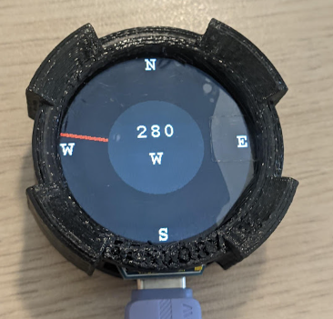

# PicoCompass
The goal of the project was to create a complete electronic device functioning as a digital compass, operating based on Earth's magnetic field measurements. A compact board with a display, battery, and additional sensors was to be enclosed in a handy case.

  

## Assumptions 
- Utilization of a board with a small circular display and an RP2040 microcontroller. 
- Design of a PCB with additional sensors, an encoder, and a debug connector. 
- Use of the C programming language. 
- Indication of the north direction based on Earth's magnetic field measurements. 
- Measurement of temperature and humidity. 
- Displaying the compass and measurement data on the screen. 
- Design and 3D printing of a durable enclosure. 

## Hardware 
- Development Board: Waveshare RP2040-LCD-1.28 featuring the RP2040 microcontroller and a circular LCD display. 
- Magnetometer: QST QMC5883L - a cost-effective chip that measures the magnetic field in three axes (x, y, z) and uses the I2C interface. 
- Temperature and Humidity Sensor: Sensirion SHT20 (equivalent to HTU21D). 
- Encoder: SMD Mitsumi Electric (push-button type). 
- LDO: Shenzhen Fuman Elec 662K (5V to 3.3V voltage regulator). 
- Passive SMD Components: Ceramic capacitors and thick-film resistors. 
- Custom PCB: Designed specifically for the project. 
- 3D Printed Enclosure: Made from durable PETG material. 

## Software 
- The project utilized the recommended Pico C/C++ Toolchain, which includes: 
- Visual Studio Code for Pico – as the main development environment. 
- GNU Arm Embedded Toolchain – for compiling the code. 
- Pico SDK – a software development kit provided by the manufacturer for programming the RP2040 microcontroller. 
- CMake + Ninja – for build configuration and build automation. 
- OpenOCD Server – for debugging and hardware interface. 

## Authors
- PCB Design and Component Assembly: Antoni Kijania 
- User Interface Development: Piotr Podkówka & Jan Trojnar 
- Development and Implementation of Sensor Libraries: Miłosz Janik & Piotr Podkówka & Jan Trojnar 
- Encoder Handling, Final Testing, and Adjustments: Miłosz Janik & Piotr Podkówka 
- Enclosure Design and 3D Printing: Miłosz Janik 

